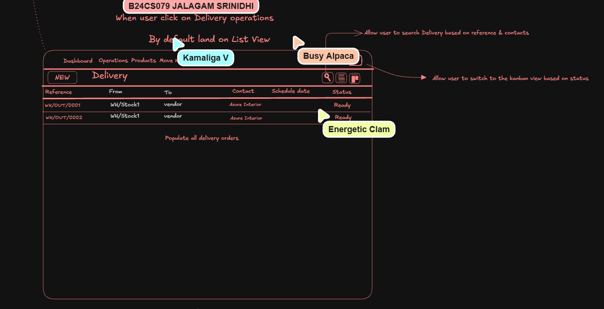

# StockSense

<p align="center">
  
</p>

[](https://github.com/AtharvK-28/StockSense/actions/workflows/ci.yml)

A modular, real-time inventory management system built for accuracy and speed. Every receipt, delivery, internal transfer, and stock adjustment is securely written to an append-only **stock ledger**. This ensures a clear audit trail of what you have, where it is, and why it changed.

---

## Table of Contents

- [Overview](#overview)
- [Key Features](#key-features)
- [Technology Stack](#technology-stack)
- [Getting Started](#getting-started)
- [Available Commands](#available-commands)
- [Core Mechanisms](#core-mechanisms)
- [Project Structure](#project-structure)
- [Documentation & Resources](#documentation--resources)

---

## Overview

StockSense is designed with a **"local-first"** philosophy, prioritizing data ownership and offline reliability.

<p align="center">
  
</p>

- **No hosted services:** It operates entirely without Firebase, Supabase, or third-party proprietary APIs.
- **Local ecosystem:** OTP emails use plain SMTP (optional), live updates use standard Server-Sent Events (SSE), and barcodes/photos are generated, read, and stored locally.
- **External integrations:** External network calls are strictly limited to optional warehouse maps (via OpenStreetMap) and directions links.

---

## Key Features

<table>
  <tr>
    <td width="50%"></td>
    <td width="50%">
      <h3>Robust Authentication & Security</h3>
      Sign up with a unique Login ID and strong password. Rate-limited logins (5 failed attempts = 15m lockout). Includes OTP password resets and <strong>Two-step verification (TOTP)</strong>.
    </td>
  </tr>
  <tr>
    <td width="50%">
      <h3>Comprehensive Dashboard</h3>
      Live KPIs for receipts, deliveries, stock levels, and scheduled transfers. Advanced valuation reports, dead stock analysis, and category-based metrics.
    </td>
    <td width="50%"></td>
  </tr>
  <tr>
    <td width="50%"></td>
    <td width="50%">
      <h3>Advanced Operations & Auto-Reordering</h3>
      Track deliveries (pick → pack → validate), partial fulfillment (backorders), and returned documents. Define rules for automatic draft receipt generation when stock runs low.
    </td>
  </tr>
</table>

- **Role-Based Access Control:** Delineate duties between **Inventory Managers** (configure rules, approve counts) and **Warehouse Staff** (submit counts, run operations).
- **Universal Export & Barcodes:** Export active views to CSV/JSON, print Code 128 labels, and scan via device cameras.
- **Cross-Platform PWA:** Fully responsive for warehouse floor usage, installable as a Progressive Web App.

---

## Technology Stack

<p align="center">
  
  
  
  
  
  
  
  
</p>

---

## Getting Started

### 🐳 With Docker (Recommended)
The fastest way to get up and running. No local dependencies required.

```bash
docker compose up --build
```
Once running, open [http://localhost:4000](http://localhost:4000) in your browser.

### 💻 Without Docker (Manual Setup)
**Prerequisites:** Node.js 20+ and PostgreSQL 14+ running locally.

```bash
# 1. Install dependencies
npm install

# 2. Configure environment variables
cp server/.env.example server/.env
# Edit .env to set DATABASE_URL and JWT_SECRET

# 3. Create the database (or use pgAdmin)
createdb stocksense

# 4. Apply migrations and load 45 days of demo history
npm run setup

# 5. Start the development servers (API on :4000, Web on :5173)
npm run dev
```

*Note for Single-process mode:* Run `npm run build && npm start` to serve both the app and API together on http://localhost:4000.

---

## Available Commands

| Command | Description |
| --- | --- |
| `npm test` | Runs vitest suites against a real `stocksense_test` database (engine, auth, roles, backorders, etc.). |
| `npm run e2e` | Runs Playwright browser tests against a separate `stocksense_e2e` database using a production build. |
| `npm run typecheck` | Type-checks both the server and client codebases. |
| `npm run db:clear -w server && npm run db:seed -w server` | Resets the database to the 45-day demo data. |
| `npm run db:clear -w server && npm run db:seed:empty -w server` | Resets the database to zero products (keeps users, warehouses, categories). |
| `npm run db:studio -w server` | Opens Prisma Studio to browse the database. |

---

## Core Mechanisms: How Stock Changes

Data integrity is paramount. Nothing changes stock except explicitly validating a document. Validation runs in a single robust database transaction:

<p align="center">
  
</p>

1. **Atomic Claims:** The document is claimed atomically (status transitions to `done`), preventing race conditions.
2. **Ledger Consistency:** Each item line locks its `stock_levels` row, verifies availability, updates the quantity, and appends a `stock_ledger_entries` row (containing the signed delta and new balance).
3. **Backorder Generation:** Lines use the exact quantity processed; unfulfilled remainders can automatically generate a backorder in the same transaction.
4. **Database-Level Rules:** Any failure rolls back the entire transaction. A database trigger rejects any `UPDATE` or `DELETE` on ledger entries, and check constraints strictly prevent negative stock values.

---

## Project Structure

```text
server/                # Express API backend
  ├── prisma/          # Schema, migrations, and seed scripts
  ├── src/services/    # Core engine (documents, stock ledger, backorders, returns, auto-reorder, audit)
  ├── src/routes/      # REST API endpoints
  └── tests/           # Vitest integration and unit tests

client/                # React frontend application
  ├── src/pages/       # Page components (Dashboard, Analytics, Operations, Settings)
  └── src/components/  # Reusable UI kit, charts, barcode scanners, pickers

e2e/                   # Playwright end-to-end browser tests
docs/                  # Requirements, ideation, PRD, TRD, and architecture documents
```

---

## Documentation & Resources

For detailed system requirements, design specs, and **demo credentials**, please refer to the `docs/` folder:
- [Demo Accounts](docs/Demo.md)
- [Product Requirements](docs/ProductRequirementsDocument.md)
- [Technical Requirements](docs/TechnicalRequirementsDocument.md)
